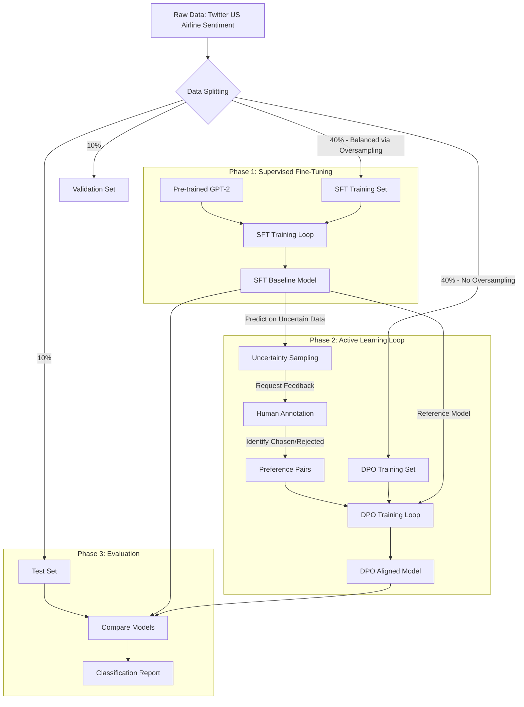

# Airline Sentiment Analysis with TRL and Active Learning (Difficulty Level: 3)

A production-ready sentiment analysis system using Direct Preference Optimization (DPO) to align GPT-2 with human preferences. The system moves beyond static classification by implementing an **Active Learning loop**, allowing users to correct uncertain predictions and refine the model iteratively through a modern Streamlit interface.

## Table of Contents

1. [Authors](#authors)
2. [Project Overview](#%EF%B8%8F-project-overview)
3. [System Architecture](#%EF%B8%8F-system-architecture)
4. [Experimental Results](#-experimental-results)
5. [Design Decisions & Intent](#-design-decisions--intent)
6. [Data Schema](#-data-schema)
7. [Docker Setup](#-docker-setup)
8. [Project Structure](#-project-structure)
9. [Usage Guide](#-usage-guide)
10. [Future Work](#-future-work)
11. [Limitations](#%EF%B8%8F-limitations)
12. [Acknowledgments](#-acknowledgments)

## Authors

**CHANAKYA CHELAMKURI , VINEET JUJJAVARAPU**

- Email: chanakya@terpmail.umd.edu , vineetj5@terpmail.umd.edu

---

## Project Overview

This project implements a sentiment analysis system that adapts over time using **Reinforcement Learning (RL)** and **Active Learning**. Unlike traditional static classifiers, this model optimizes its accuracy based on feedback loops, moving from a standard supervised baseline to a preference-tuned model aligned with human judgment.

## System Architecture

The following diagram illustrates the multi-stage training pipeline, specifically highlighting the data splitting strategy and the active learning loop.



---

## Design Decisions & Intent

### 1\. Model Choice: Why GPT-2 over BERT?

While BERT is a standard encoder for classification, we chose **GPT-2** for this project.

- **Reasoning**: TRL (Transformer Reinforcement Learning) is optimized for generative, autoregressive models. BERT's masked modeling objective does not naturally align with TRL's preference optimization abstractions.
- **Implementation**: We treat sentiment analysis as a generative task (Prompt: `Tweet: X`, Output: `Sentiment: Positive`). This unifies SFT and RL into a single generative framework.

### 2\. RL Algorithm: Why DPO over PPO?

We selected **Direct Preference Optimization (DPO)** instead of Proximal Policy Optimization (PPO).

- **Reasoning**: PPO requires a separate reward model and complex hyperparameter tuning, which causes instability in small-scale setups. DPO is strictly more stable as it optimizes preferences directly without an explicit reward function.
- **Implementation**: The "reward" is implicit—derived from the log-probability divergence between the trained policy and the frozen SFT reference model.

### 3\. Data Strategy: Hybrid Splitting

To prevent data leakage and bias, we use a stratified splitting strategy:

- **SFT Split (40%)**: We **oversample** minority classes here to ensure the baseline learns all classes equally.
- **DPO Split (40%)**: We **do not oversample** here. Repeating examples in preference training can destabilize the policy by artificially inflating confidence.

---

## Data Schema

The project expects a dataset file named `Tweets.csv` with the following structure:

| Column              | Type   | Description                                                            |
| :------------------ | :----- | :--------------------------------------------------------------------- |
| `text`              | String | The raw tweet content (cleaned internally by `trl_utils.clean_tweet`). |
| `airline_sentiment` | String | Target label. Must be one of: `negative`, `neutral`, `positive`.       |

---

## Clone the Repository & Navigate to the folder(if not already)

```bash
git clone https://github.com/blank4hd/RL_Airline_Sentiment_Analysis_with_trl.git
```

Folder Name: RL_Airline_Sentiment_Analysis_with_trl

```bash
cd "<replace_with_your_path>/RL_Airline_Sentiment_Analysis_with_trl"
```

## 🐳 Docker Setup

This project includes a containerized environment to ensure reproducibility.

### To Build the Image

```bash
docker-compose build
```

### To Run the Container

```bash
docker-compose up
```

**Expected Terminal Output:**

- The container will launch and mount the local volume.
- Jupyter Lab will start on port **8888**.
- Streamlit will be exposed on port **8501**.

**Accessing the Services:**

- **Jupyter Lab**: `http://localhost:8888` (Token: `airline`)
- **Streamlit App**:
  1.  Keep the container running.
  2.  Open a new terminal.
  3.  Run:
  ```bash
    docker exec -it trl_airline_lab streamlit run trl_app.py
  ```
  4.  Visit `http://localhost:8501`

---

## 📂 Project Structure

| File                | Intent                                                                                                       |
| :------------------ | :----------------------------------------------------------------------------------------------------------- |
| `trl_utils.py`      | Contains reusable logic for data loading, cleaning, and the `SentimentModel` wrapper. Keeps notebooks clean. |
| `trl.API.ipynb`     | Documents the API interface. Demonstrates how to initialize models and run predictions.                      |
| `trl.example.ipynb` | The executable "proof of concept" notebook. Runs the full pipeline from data loading to evaluation.          |
| `trl_app.py`        | Interactive dashboard for human-in-the-loop feedback and testing.                                            |

---

## Usage Guide

### 1\. Running the Benchmark (Notebook)

Open `trl.example.ipynb` in Jupyter Lab.

- **Step 1**: Run all cells to load the `Tweets.csv` data.
- **Step 2**: The notebook will initialize the 4 model variants (BERT, GPT-2 Baseline, Improved SFT, DPO).
- **Step 3**: It will perform inference on the held-out test set and generate a classification report.

### 2\. Active Learning Playground (Streamlit)

Launch the Streamlit app to test the feedback loop.

- **Input**: Type a custom airline tweet.
- **Feedback**: Correct the model's prediction if it is wrong.
- **RL Update**: In a full production loop, this feedback is saved as a preference pair to retrain the DPO model.

---

## Future Work

- **Model Scale**: Upgrade from GPT-2 (Small) to a larger model like **Llama-2-7b** or **Mistral-7b** to improve reasoning capabilities on complex tweets.
- **Reward Modeling**: Implement a separate Reward Model (RM) to provide more granular signals during RL training, rather than relying solely on the reference model divergence.
- **Multilingual Support**: Expand the dataset to include non-English tweets to test cross-lingual sentiment adaptation.

---

## ⚠️ Limitations

- **Base Model Size**: The project uses GPT-2 (124M parameters) due to compute constraints. While efficient, it struggles with highly nuanced sarcasm compared to modern LLMs.
- **Synthetic Feedback**: The current Active Learning loop simulates human feedback in the notebook demo. In a real-world deployment, this would require a persistent database backend rather than a CSV file.

---

## 🙏 Acknowledgments

- **Hugging Face TRL Library**: For providing the PPO and DPO trainer abstractions.
- **Kaggle**: For hosting the _Twitter US Airline Sentiment_ dataset.
- **Streamlit**: For enabling the rapid development of the interactive feedback UI.

<!-- end list -->
